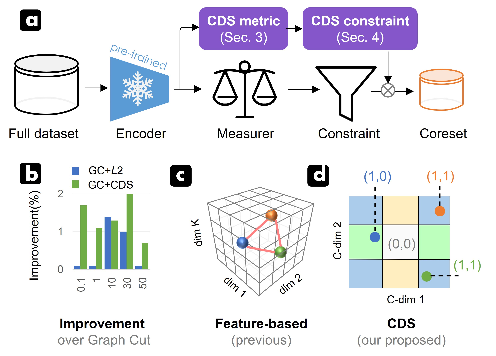

# contributing-dimension-structure
> Contributing Dimension Structure of Deep Feature for Coreset Selection [[paper](https://arxiv.org/pdf/2401.16193.pdf)]
>
> [Zhijing Wan](https://scholar.google.com/citations?user=eClFXFEAAAAJ&hl=zh-CN&oi=sra), [Zhixiang Wang](https://scholar.google.com/citations?user=yybzbxMAAAAJ&hl=en), [Yuran Wang](https://scholar.google.com/citations?user=ZGq8cbIAAAAJ&hl=zh-CN&oi=ao), [Zheng Wang](https://scholar.google.com/citations?user=-WHTbpUAAAAJ), [Hongyuan Zhu](https://hongyuanzhu.github.io/), [Shin’ichi Satoh](https://scholar.google.com/citations?hl=zh-CN&user=7aEF5cQAAAAJ)
>
> AAAI2024

## Introduction

<div align="center">
  
</div>

> **Abbreviation:** CDS&rarr;Contributing Dimension Structure; dim&rarr;dimension;

> **Note:** Here we set the pruned dimension (C-dim) to 2 for demonstration.

- (a) We combine the proposed CDS metric and constraint with the current coreset selection pipeline. CDS metric explicitly introduces the information on the Contributing Dimension Structure (CDS). CDS constraint is used to enrich the diversity of CDS in the coreset based on the CDS relationship matrix.
- (b) CDS metric and constraint enhance the performance of SOTA---GC, which uses the gradient information during the importance measurement. Although replacing the CDS metric with *L*2 distance employed by previous feature-based methods can improve GC, integrating our proposed CDS metric is more effective since it can capture more diverse, informative samples.
- (c) vs. (d): Previous feature-based methods using *L*2 metric could treat three distinct samples as equivalent, while our CDS metric effectively distinguishes these samples by pruning the feature space and representing the space in different partitions.

### Datasets
We have verified the effectiveness of our method on CIFAR10, CIFAR100 and TinyImageNet.

### Example

Select the coreset from CIFAR100 with "Least Confidence" (fraction 0.1, class balanced sampling)
```sh
CUDA_VISIBLE_DEVICES=0 python -u main.py --fraction 0.1 --dataset CIFAR100 --data_path /to/your/datasets --num_exp 5 --workers 4 --optimizer SGD -se 10 --selection Uncertainty --model ResNet18 --lr 0.1 -sp /to/your/save/path --batch 128 --uncertainty LeastConfidence
```

Select the coreset from CIFAR100 with "Least Confidence + Hard CDS" (fraction 0.1, class balanced sampling)
```sh
CUDA_VISIBLE_DEVICES=0 python -u main.py --fraction 0.1 --dataset CIFAR100 --data_path /to/your/datasets --num_exp 5 --workers 4 --optimizer SGD -se 10 --selection Uncertainty_Hard --model ResNet18 --lr 0.1 -sp /to/your/save/path --batch 128 --uncertainty LeastConfidence
```

Select the coreset from CIFAR10 with "Graph Cut" (fraction 0.1, class balanced sampling)
```sh
CUDA_VISIBLE_DEVICES=0 python -u main.py --fraction 0.1 --dataset CIFAR10 --data_path /to/your/datasets --num_exp 5 --workers 4 --optimizer SGD -se 10 --selection Submodular --model ResNet18 --lr 0.1 -sp /to/your/save/path --batch 128
```

Select the coreset from CIFAR10 with "Graph Cut + Soft CDS" (fraction 0.1, class balanced sampling)
```sh
CUDA_VISIBLE_DEVICES=0 python -u main.py --fraction 0.1 --dataset CIFAR10 --data_path /to/your/datasets --num_exp 5 --workers 4 --optimizer SGD -se 10 --selection Submodular_Soft --model ResNet18 --lr 0.1 -sp /to/your/save/path --batch 128 --submodular GraphCut_CDS
```

If you make use of our work, please consider to cite:

```bibtex
@article{wan2024contributing,
title={Contributing Dimension Structure of Deep Feature for Coreset Selection},
volume={38},
number={8},
journal={Proceedings of the AAAI Conference on Artificial Intelligence},
author={Wan, Zhijing and Wang, Zhixiang and Wang, Yuran and Wang, Zheng and Zhu, Hongyuan and Satoh, Shin’ichi},
year={2024},
month={Mar.},
pages={9080-9088}
}
```

## Credits
The implementation is based on [DeepCore](https://github.com/PatrickZH/DeepCore) code. Thanks for their brilliant work!
